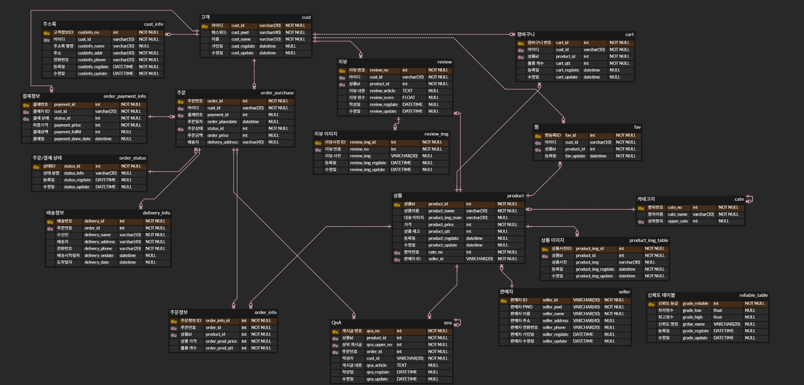

# Spring boot 기반의 중고거래 시스템
***
## 팀원 및 역할
|이름| 담당 역할                |
|:----|:---------------------|
|손세형||
|신창영||
|문태건| |
|김유진| |
***
## 프로젝트 개요
### 개발 목적 및 배경
기존의 중고거래의 문제점은 사기, 품질 문제, 개인의 안전등의 다양한 위험을 수반한 형태의 거래가 이루어 졌습니다.
이러한 문제를 줄이고자 중고거래를 기업을 통하여 이루어지게 된다면 신뢰도 향상, 품질 개선, 안전성 향상등의 기존의 문제점을 해결하고
더욱 활발하고 안전한 중고거래 문화가 정착하는 것이 목표입니다.
***
## 프로젝트 계획도

***

## ERD

***
## 개발환경 및 개발도구

협업도구: Github, ERD Cloud  
개발도구: IntelliJ  
언어: Java, JavaScript,HTML5,CSS,SQL  
Database: MySQL  
프레임워크: Spring Boot, My Batis, Bootstrap  

***
## 메인페이지
