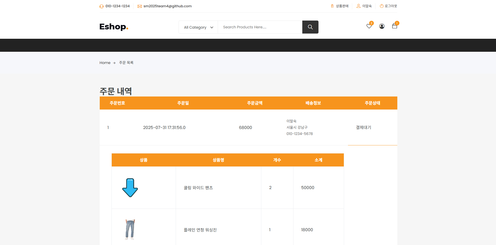

# Spring boot 기반의 중고거래 시스템

***
# 1. 프롤로그
## 📌개발 목적 및 배경
사기, 품질 문제, 거래자간 개인 안전 문제 등 기존 중고거래 방식은 다양한 위험을 수반합니다. 
특히 사기 및 품질 문제는 중고 거래에 있어 가장 심각한 문제로, 이는 판매자와 구매자 간의 신뢰가 형성되기 어려운 환경을 유발해 
중고 거래 시장에 있어 매우 부정적인 영향을 미치기 때문입니다. 
이에 상품 등록과 판매 사이에 중개자가 판매자의 신원과 상품의 품질을 검증하고, 이를 구매자에게 보증할 수 있어
거래자 간의 신뢰 회복, 나아가 시장의 건전성 유지에 도움이 될 시스템이 요구되는 상황입니다. 

 

## 📌개발 의도
기존 중고거래 방식의 근본적인 문제점은 거래 자체가 개인과 개인 사이의 거래로 한정되어있으므로, 
사기나 품질 문제와 같은 분쟁이 발생하더라도 그 책임을 묻기 매우 어려웠습니다.

따라서 이를 중점으로 잡아, 거래자 사이에 기업이 중개자로 입회하여 신뢰 및 품질을 보증할 수 있는 사이트를 구축하는 것이 목표입니다.
이를 통해 신뢰도 향상, 품질 개선, 안전성 향상 등과 같은 개선사항을 기반으로 더욱 활발하고 안전한 중고거래 문화가 정착해, 
신뢰할 수 있는 중고거래 시장이 되는 것이 기대됩니다.

 

***
## 🧑‍💻팀원 및 역할
|이름| 담당 역할 |
|:----|:-----|
|손세형|      |
|신창영|      |
|문태건|      |
|김유진|      |

 

***

**기간 :**  2025.06.23 ~ 2025.08.01

***
# 2. 프로젝트 개요
## 프로젝트 계획도

 

## ERD

 

## 화면 흐름도

 

***
## 🛠 개발환경 및 개발도구

| 분류       | 도구                                |
|:---------|:----------------------------------|
| 협업도구     | Github, ERD Cloud                 |
| 개발도구     | IntelliJ                          |
| 언어       | Java, JavaScript, HTML5, CSS, SQL |
| Database | MySQL                             |
| 프레임워크    | Spring Boot, My Batis, Bootstrap  |

 

***
# 3. ✅주요기능
### 1. 메인 기능
- 로그인 및 회원가입
- 상품 정보 페이지
  - 상품 상세정보 페이지
  - 상품 리뷰
  - 상품 Q&A
  - 주의사항
- 결제

### 2. 사용자 기능
- 마이페이지
  - 장바구니
  - 찜하기
  - 주문 내역
  - 사용자 정보 수정
  - 주소록 관리

***
# 메인 기능
## 메인페이지

- 우측 상단의 바를 통해서 회원가입 및 로그인 가능
- 로그인 성공시 우측 상단에 이름과 로그아웃 기능 출력
- 마이페이지, 장바구니, 찜, 상품 상세 페이지 이동 가능

 

## 상품페이지

- 캐로셀을 이용하여 최근 등록된 상품 조회

 

## 상품 상세정보

- 상품의 판매자, 등록일, 태그, 상품이름, 가격, 남은 수량을 나타냄
- 스크롤 네비게이션을 통하여 상품 리뷰, 상품 Q&A, 주의사항 이동

 

## 결제 페이지

- 결제전 상품의 개수의 증가 및 감소, 상품 삭제 기능

- 사용자의 저장된 주소록 불러오기 및 직접 입력 선택

***
# 사용자 기능
## 마이페이지

- 사이드 메뉴를 통해 원하는 기능으로 이동
- 이름, 비밀번호 변경

 

## 주소록 관리

- 상품 배송을 위한 주소록 생성, 수정, 삭제

 

## 장바구니

- 상품 개수 증가 및 감소, 총 금액 산출, 상품 삭제 기능
- 결제 페이지 이동

 

## 찜

- 관심있는 상품들을 찜 목록에 저장하여 장바구니로 이동

 

## 주문 내역

- 결제한 상품들의 현 주문 상태를 확인하며 결제 정보를 제공

***