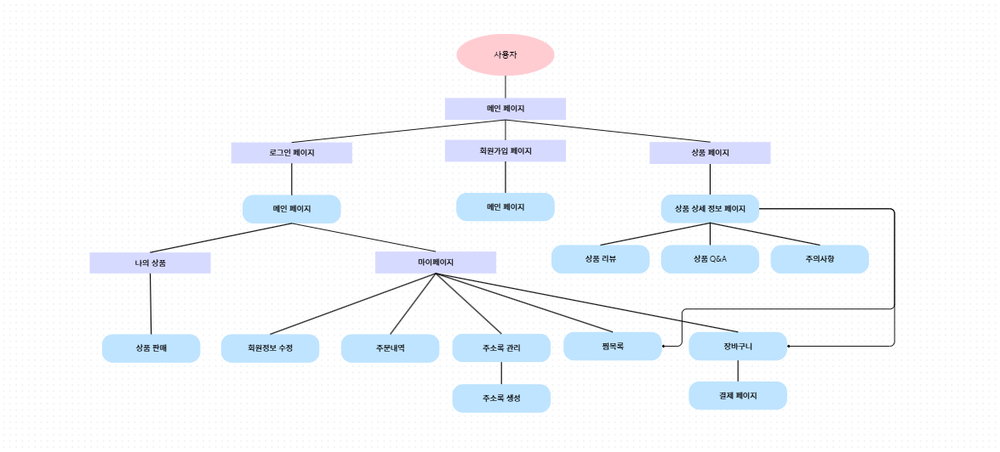
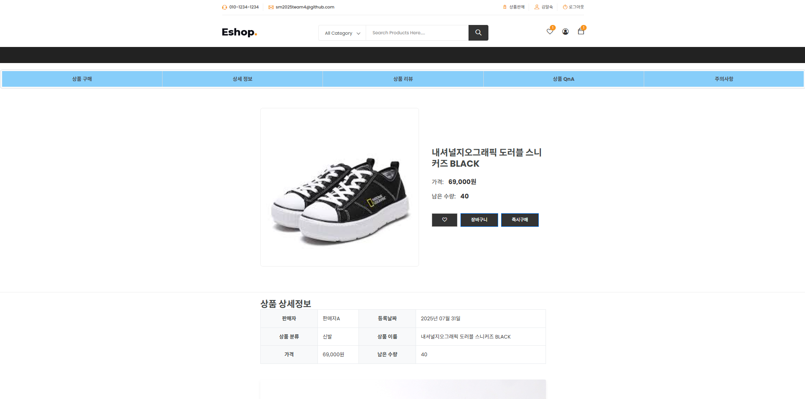

# Spring boot 기반의 중고거래 시스템

***
# 1. 프롤로그
## 📌개발 목적 및 배경
기존의 중고거래의 문제점은 사기, 품질 문제, 개인의 안전등의 다양한 위험을 수반한 형태의 거래가 이루어 졌습니다.
이러한 문제를 줄이고자 기업에서 상품을 확인한 후 사이트에서 판매를 하려고 합니다

 

## 📌개발 의도 
중고거래를 기업을 통하여 이루어지게 된다면 신뢰도 향상, 품질 개선, 안전성 향상등의 기존의 문제점을 해결도리 것이며
더욱 활발하고 안전한 중고거래 문화가 정착하게 될것이며 신뢰할 수 있는 중고거래 시장을 만드는 것이 목표입니다.

 

***
## 🧑‍💻팀원 및 역할
|이름| 담당 역할 |
|:----|:-----|
|손세형|      |
|신창영|      |
|문태건|      |
|김유진|      |
 

***

**기간 :**  2025.06.23 ~ 2025.08.01

***
# 2. 프로젝트 개요
## 프로젝트 계획도

 

## ERD

 

## 화면 흐름도

 

***
## 🛠 개발환경 및 개발도구

협업도구: Github, ERD Cloud  
개발도구: IntelliJ  
언어: Java, JavaScript, HTML5, CSS, SQL  
Database: MySQL  
프레임워크: Spring Boot, My Batis, Bootstrap  
***
# 3. ✅주요기능
### 1. 메인 기능
- 로그인 및 회원가입
- 상품 정보 페이지
  - 상품 상세정보 페이지
  - 상품 리뷰
  - 상품 Q&A
  - 주의사항
- 결제

### 2. 사용자 기능
- 마이페이지
  - 장바구니
  - 찜하기
  - 사용자 정보 수정
  - 주소록 관리

***
# 메인 기능
## 메인페이지

- 우측 상단의 바를 통해서 회원가입 및 로그인 가능
- 로그인 성공시 우측 상단에 이름과 로그아웃 기능 출력
- 마이페이지, 장바구니, 찜, 상품 상세 페이지 이동 가능

 

## 상품페이지

- 캐로셀을 이용하여 최근 등록된 상품 조회

 

## 상품 상세정보

- 상품의 판매자, 등록일, 태그, 상품이름, 가격, 남은 수량을 나타냄
- 스크롤 네비게이션을 통하여 상품 리뷰, 상품 Q&A, 주의사항 이동

 

## 결제 페이지

- 결제전 상품의 개수의 증가 및 감소, 상품 삭제 기능

- 사용자의 저장된 주소록 불러오기 및 직접 입력 선택

***
# 사용자 기능
## 마이페이지

- 사이드 메뉴를 통해 원하는 기능으로 이동
- 이름, 비밀번호 변경

 

## 주소록 관리

- 상품 배송을 위한 주소록 생성, 수정, 삭제

 

## 장바구니

- 상품 개수 증가 및 감소, 총 금액 산출, 상품 삭제 기능
- 결제 페이지 이동

 

## 찜

- 관심있는 상품들을 찜 목록에 저장하여 장바구니로 이동

***
